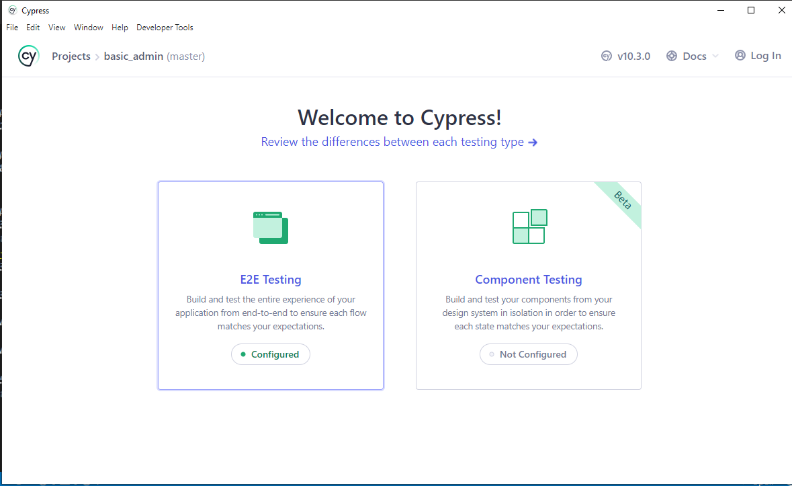
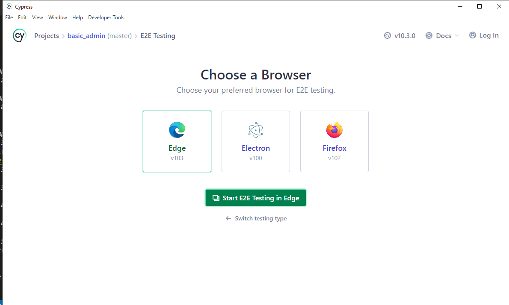
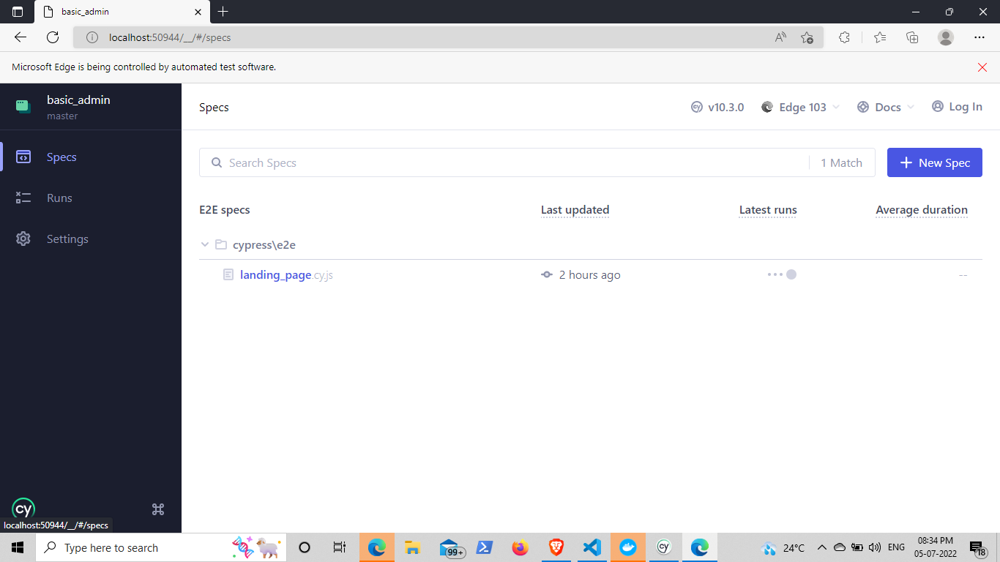
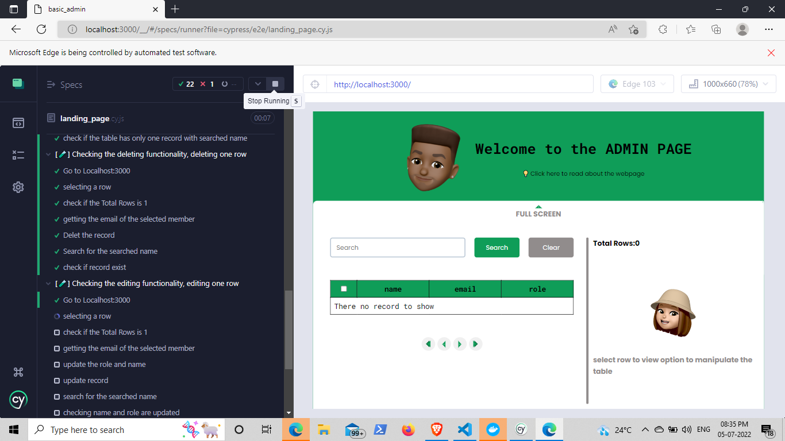

# Admin UI

[Published Link](https://suvel.github.io/admin_basic/)

### Desc

This is an project that I have crated for show casing my design and implementation of a Frontend application.

I took up this topic from [Geektrust](https://www.geektrust.com/coding/detailed/admin-ui) and it requirement are:

1. Column titles must stand out from the entries.
2. There should be a search bar that can filter on any property.
3. You should be able to edit or delete rows in place.(There is no expectation of persistence. Edit and delete are expected to only happen in memory.)
4. You need to implement pagination: Each page contains 10 rows. Buttons at the bottom allow you to jump to any page including special buttons for first page, previous page, next page and last page. Pagination must update based on search/filtering. If there are 25 records for example that match a search query, then pagination buttons should only go till 3.
5. You should be able to select one or more rows. A selected row is highlighted with a grayish background color. Multiple selected rows can be deleted at once using the 'Delete Selected' button at the bottom left.
6. Checkbox on the top left is a shortcut to select or deselect all displayed rows. This should only apply to the ten rows displayed in the current page, and not all 50 rows.

### installing and using the application

1. Clone the repo
2. Go to the root directory and install the dependencies, please use the below command for the same

```
npm i
```
3. To run the application use the below command
```
npm start
```
4. To test the application use the below command ( make sure the application is running)
```
npm run cypress:open
```
6. Update the port where the application is running in "application.conf.js"
7. Select the testing type "E2E"

8. Select the browser to test the application

9. Select "Spec" in the side bar

9. To reload the test use the reload button at the top.
